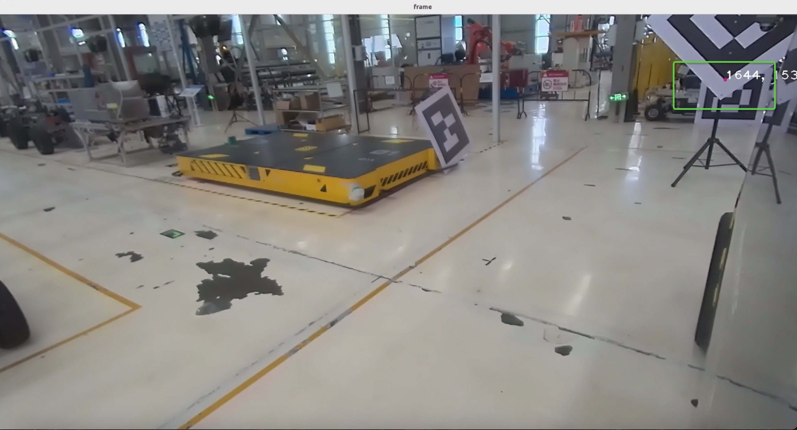
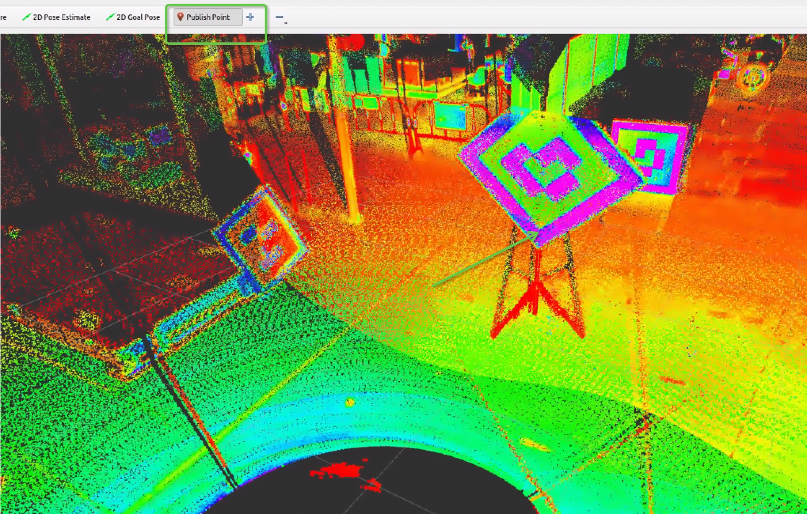
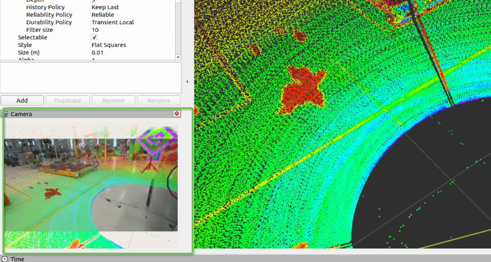

# ARCHITECTURE


# HOW TO USE

## load pcd file and show Rviz in new terminal
```bash
ros2 launch manual_lidar_camera_calibration pointcloud_loader.launch.xml
```

## load image file and show opencv window in new terminal
```bash
ros2 launch manual_lidar_camera_calibration camera_points_publisher.launch.xml
```

## launch extrinsic calibrator in new terminal
```bash
ros2 launch manual_lidar_camera_calibration extrinsic_calibrator.launch.xml
```

## click camera points in opencv window


## use Publish Points tool to click point from pointcloud in Rviz


## visualize the calibration result in Rviz


